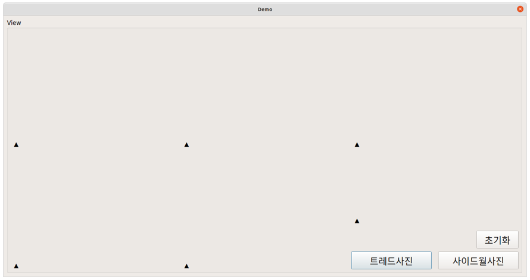

# TireDamageDetection
CNN-based vehicle tire wear and damage detection

This project was implemented to achieve 3 main objectives.
1. Tire tread wear detection
2. Detection of tire damage
3. Tire model code recognition

To achieve the above objectives, we mainly used a total of 6 individually trained models in 2 deep neural network structures.   
The structure of the deep neural networks used for learning is as follows:
1. [Mask-R-CNN](https://github.com/matterport/Mask_RCNN)
2. [deep-text-recognition-benchmark](https://github.com/clovaai/deep-text-recognition-benchmark)

# How to use it 
```
### create virtual environment

$ cd TireDamageDetection/
$ conda env create -f environment.yaml

### run GUI
$ python demoV2.py 
```

- You need to download pre-trained model files before using this source.
- Download the files from our [GoogleDrive](https://drive.google.com/drive/folders/1IOjWcwxxYZwVwmchod_6d-pJG5o9Q9kA?usp=sharing) and place it in the paths below.

```
### specific paths of pre-trained models

tire/
- TPS-ResNet-BiLSTM-Attn-SEP-0527.pth
- TPS-ResNet-BiLSTM-Attn-WHOLE-0607.pth

tire/model/
- defect_model.h5
- histo_dot_model.h5
- sidewall_model.h5
- tread_model.h5
- wear_safeWarning_model.pth
```

# Screenshots



